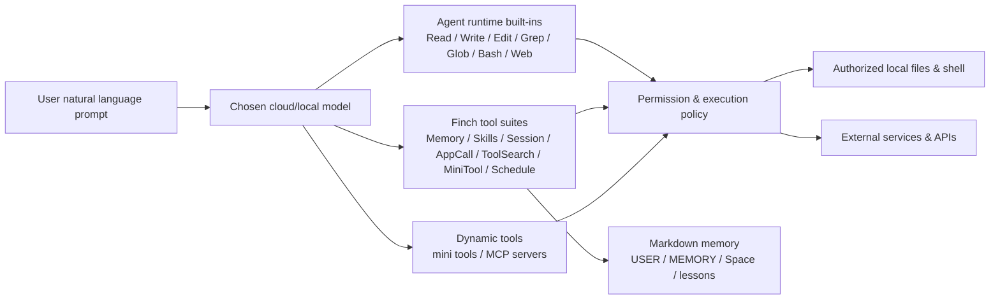

# Finch Agent 深度分析

## TL;DR

- Finch 的准确形态是「模型无关的桌面个人 Agent」；编码是能力底座，而非唯一定位。
- 差异化集中在 Space 级规则与记忆、`AGENTS.md`、可插拔 mini tools、Skills、MCP、多模型接入。
- 外部作者自述累计消耗 62 亿 token 且体验流畅；这是有价值的一手反馈，但仍是单样本且无法独立复核。
- 架构上把「确定性代码」与「模型探索」分离，交互态工具经权限网关；这是比“更快的壳”更重要的产品判断。
- 主要风险是生态早期、记忆污染、自动化权限更宽松、第三方插件供应链与云模型数据外发边界。

## 1. 产品概览

- **公司 / 团队**：Finch Toys；官网与 GitHub 组织均以 Finch Toys / finchtoys 发布产品资料 [2][13]。
- **公开历史**：截至 2026-09-13，官方 About 称当前版本 1.6.3、累计 18 个公开 release [2]；GitHub Releases 可追溯 17 个版本，其中 v1.1.0 正文标注日期为 2026-05-15，v1.6.3 发布于 2026-09-10 [11][13]。更早的确切上线时间待核实。
- **一句话定位**：面向 macOS、Windows 与 Linux Beta 的轻量桌面 AI Agent，用自然语言操作本地授权文件、跨会话记忆、模型、扩展与定时自动化 [1][2]。
- **目标用户与核心场景**：
  - 创作者与知识工作者：整理、阅读、写作、个人知识库 [2]。
  - 独立开发者与产品构建者：本地编码、建站、做小游戏/小应用、处理数据 [2]。
  - 个人与小团队：资料收集、运营摘要、监控报告等周期任务 [2][7]。

### 分类判断

本报告将其放入 `coding-agents`，原因是其本地文件、Shell、编码、仓库规则和开发者扩展能力足以支撑 coding agent 场景；但需要强调，Finch 官方定位比 coding agent 更宽，覆盖知识管理与通用桌面自动化 [1][2][14]。如果后续 taxonomy 拆出“桌面个人 Agent”或“personal agent workspace”，Finch 应优先迁移到更精确的分类。

## 2. 核心能力

| 能力 | 说明 | 截至日期 | 来源 |
|---|---|---|---|
| 桌面 Agent | macOS Apple Silicon/Intel、Windows 10/11、Linux Beta；当前版本 1.6.3 | 2026-09-13 | [2][12] |
| 多模型 | 官方列出 Claude/Anthropic API、ChatGPT/OpenAI API、Codex 登录、DeepSeek、Kimi、智谱 GLM、MiniMax、小米 MiMo 等 13+ 云服务商，也支持自定义 provider 与本地模型 | 2026-09-13 | [2][3][14] |
| 订阅复用 | 可用已有 Claude 或 ChatGPT 订阅登录，也可同时配置 API key | 2026-09-13 | [3][14] |
| Space | 按项目/长期工作分组；目录绑定 Space 自动读写该目录并加载项目 `AGENTS.md`，非目录绑定 Space 使用 Finch 内部规则文件 | 2026-09-13 | [4] |
| 跨会话记忆 | 记忆不是完整聊天记录，而是提炼为 `USER.md`、`MEMORY.md`、Space memory、lessons 等可查看/可编辑的 Markdown | 2026-09-13 | [5][6] |
| 上下文压缩 | 长对话接近上下文上限时自动压缩旧消息，仅作用于当前对话 | 2026-09-13 | [5] |
| 定时自动化 | 按小时/天/工作日/周触发 prompt，可指定 Space 与模型；未完成的任务不叠加，错过后等待下一周期 | 2026-09-13 | [7] |
| Mini tools | npm/TypeScript 包形态的代码级扩展，可贡献工具、Composer 按钮、会话容器、Skills、MCP server；运行在独立进程 | 2026-09-13 | [9][13] |
| Skills | 以 `SKILL.md` 为根的 Markdown 指南包，用于流程、约定与方法论；按当前 Space、Finch home、全局目录分层发现 | 2026-09-13 | [9][10] |
| MCP | 通过 MCP bridge 连接外部 server；MCP 工具不预加载，需经 `ToolSearch` 激活 | 2026-09-13 | [8] |
| 权限控制 | 内置工具按 auto-allow、fast lane、每次确认分层；mini tool 贡献的工具默认每次调用均需确认 | 2026-09-13 | [8] |
| 生态注册表 | 2026-09-13 检查社区 registry 时，`mini-tools.json` 收录 29 个 mini tools，`skills.json` 收录 11 个 skills | 2026-09-13 | [13] |

## 3. 外部使用反馈与证据校验

> 本报告未做一手实测。以下主要来自用户提供的微信文章，属于单一作者自述，不能当作 statistically representative 的用户体验结论 [16]。

### 3.1 作者核心主张

| 作者主张 | 证据与校验 | 判断 |
|---|---|---|
| 深度使用后累计消耗 62 亿词元，日常 3–5 亿/天，2026-09-11 单日最高 11.5 亿 | 原文自述并展示截图，但 token 统计无法从外部复核 | 可作为重度使用信号；不能作为效率或性价比证明 |
| 会话切换“瞬间显示”，在同类工具中最快 | 单作者主观体验，未见可比基准 | 待实测；高频长会话确实是 Finch 近期 changelog 的优化重点 |
| Space 级 `Agents.md` 能隔离 monorepo 子项目约束 | 官方 Space 文档确认：目录绑定 Space 加载该目录下 `AGENTS.md`，且 Space 记忆互不干扰 [4] | 方向可信；父目录/仓库级规则是否级联需实测 |
| 仓库级 `AGENTS.md` 不会自动加载，需要手动提醒 | 官方 auto-loaded files 文档只说明加载目录绑定 Space 的 `AGENTS.md`，未说明加载父级 `AGENTS.md` [6] | 与文档一致；monorepo 用户应显式验证 |
| Mini programs 比 Skills 更稳定，因为功能由代码固定 | 官方将 mini tool 定义为可执行代码、Skill 定义为 Markdown 指令 [9] | “确定性问题交给代码”成立；但“100% 稳定”过强，插件代码、外部服务与权限交互仍可能失败 |
| Finch 会自动总结经验，越用越懂用户 | 官方 memory 文档确认会做选择性记忆、可编辑、可遗忘，且 private mode 不蒸馏 [5] | 能力存在；“越用越聪明”取决于记忆质量，也存在陈旧记忆风险 |

### 3.2 对性能主张的交叉检查

官方 changelog 显示，Finch 近期持续修复流式内容回滚、切换会话时的闪烁、压缩边界丢失、后续建议丢失等问题，并优化会话列表、渲染与窗口恢复 [11]。这给出两个判断：

1. **团队确实把高频长会话性能视为核心体验**，与外部文章的感知方向一致。
2. **近期仍在修大量会话/压缩/渲染 bug**，说明产品处于快速迭代期；在把它当作主力环境前，应用自己的长会话和 monorepo 项目做基准测试。

## 4. 技术架构

### 4.1 分层

### 4.2 关键机制

- **底层模型**：不绑定单一厂商；Quick/Think 模式按会话与自动化任务分别选择，模型能力决定是否支持 thinking [3]。
- **工具与协议**：内置 agent runtime primitives、Finch dispatcher tools、mini tools 与 MCP 四层工具来源；对模型而言都表现为 function call [8]。
- **记忆与上下文**：
  - `SOUL.md`、`FINCH.md`、`USER.md`、`MEMORY.md` 会按规则自动进入上下文 [6]。
  - Memory 负责跨会话沉淀，compaction 只负责当前长对话的摘要压缩 [5]。
  - 可为记忆与辅助任务单独选择低成本模型，避免占用主模型额度 [5]。
- **部署形态**：本地桌面客户端 + 用户选择的云模型/API/订阅，或本地模型；不是纯云 SaaS，也不等价于完全离线工具 [2][14][15]。

### 4.3 架构评价

Finch 最值得关注的不是“又一个聊天壳”，而是把四类边界显式产品化：

1. **上下文边界**：Space 隔离项目规则、记忆与权限，减少 monorepo 或多项目串扰。
2. **能力边界**：Skill 适合把“模型不知道的流程”写成说明，mini tool 适合把“模型不该临场发挥的动作”写成代码。
3. **工具暴露边界**：不把所有 MCP/mini tool 全量塞进 system prompt，而通过 `ToolSearch` 按需激活，能降低上下文消耗和误选率 [8]。
4. **信任边界**：mini tool 每次调用需确认，内置工具分层授权，第三方代码不能直接调用 Electron/Finch 内部接口 [8][9]。

## 5. 定价与商业模式

| 方案 | 价格 / 方式 | 包含内容 | 截至日期 |
|---|---|---|---|
| Desktop app | 免费，官方称永久免费 | Finch 桌面客户端 | 2026-09-13 |
| 模型用量 | 用户自带 API key / 本地模型；或登录已有 Claude、ChatGPT 订阅 | 云模型 token 或订阅额度 | 2026-09-13 |
| 云服务与可选服务 | 官方 FAQ 称部分 optional cloud services 按所选服务另行计费 | 具体项与价格未在公开页面完整列出，待核实 | 2026-09-13 |
| Finch Plan | changelog 中存在模型目录、订阅状态、quota 相关修复 | 公开页面未披露完整价格与权益，待核实 | 2026-09-13 |
| Enterprise | 联系销售 | 多模型、云/混合/本地部署、企业工作流扩展 | 2026-09-13 |

来源：[2][7][11][14][19]。

**商业模式解读**：客户端免费降低获客门槛，模型账号与 token 由用户承担，使 Finch 可以同时覆盖 Claude/ChatGPT 订阅用户、API 用户和本地模型用户。对重度用户来说，真实成本不在客户端，而在模型订阅、API、额度和自动化任务频率。

另一篇第三方法语概述对 local-first、权限、模型无关、mini tools / Skills / MCP 的描述与官方文档一致，但内容主要转述官方材料，本文只将其作为定位交叉参考，不作为独立体验证据 [17]。

## 6. 生态与集成

截至 2026-09-13，公开 registry 中包含 29 个 mini tools 与 11 个 skills [13]。示例方向包括：

- **文档**：anydoc 读取 Word、Excel、PowerPoint、OpenDocument、RTF、EPUB、CSV、PDF。
- **浏览器/调试**：browser-tools、chrome-devtools。
- **搜索**：Brave Search。
- **MCP**：官方 MCP bridge。
- **协作/消息**：WeChat bot、WeCom bot、Notion 等官方或社区扩展。

生态策略上，Finch 不把社区扩展全部打进客户端，而是在运行时拉取推荐 registry，再通过 npm/public source 安装 [13]。这有利于客户端轻量化和更新速度，但把安全审查、版本稳定性和供应链治理变成了更关键的用户责任。

## 7. 优势与局限

### 优势

1. **模型无关与订阅复用**：避免单厂商锁定，适合把不同任务分配给不同模型。
2. **上下文工程产品化**：Space、记忆、压缩、`AGENTS.md`、Skills 的组合比纯聊天历史更可控。
3. **确定性扩展**：mini tools 能把 API、UI、账号、会话容器等稳定能力交给代码，降低重复 prompt 的不确定性。
4. **权限分层**：内置工具、危险 Shell、mini tool、MCP 的授权策略不同，特别是第三方工具默认每次确认。
5. **覆盖个人工作流闭环**：从本地文件、编码、知识沉淀到定时自动化，适合“个人操作中心”场景。

### 局限与风险

1. **生态仍小且年轻**：29 个 mini tools / 11 个 skills 的 registry 规模有限，官方扩展与社区扩展的成熟度需逐个验证。
2. **记忆质量是双刃剑**：错误约定、过期项目事实或误蒸馏可能污染后续会话；需要定期检查 `USER.md`、`MEMORY.md` 与 Space memory。
3. **monorepo 规则层级待验证**：目录绑定 Space 只明确加载绑定目录的 `AGENTS.md`；父级/仓库级规则是否级联，应实测后再依赖。
4. **自动化权限更宽松**：官方 automation 文档说明无人值守时采用更 permissive 的默认策略并自动批准常见动作；启用前必须审查任务、目录与账号授权 [7]。
5. **第三方插件供应链风险**：mini tools/Skills/MCP 可能访问文件、网络、Shell、密钥、账号或系统资源；官方隐私与条款均要求用户审查来源、代码、权限和政策 [15]。
6. **local-first 不等于私有**：只要选择云模型或在线服务，相关内容仍会按用户配置发送给第三方；严格隐私场景应使用本地模型并关闭不必要的网络工具 [14][15]。
7. **Linux 仍是 Beta**：跨平台生产使用前应优先验证目标系统包与自动化稳定性 [12]。
8. **企业治理待验证**：官网提供 Enterprise 的云/混合/本地部署叙事，但公开资料未展开审计、权限管理、数据保留、SSO/SCIM、合规细节，采购前需向官方确认 [19]。

## 8. 竞品速览

> 下表使用 Finch 官方 comparison 页面中“已核验”的公开事实与官方文档交叉整理，供定位参考；不构成横向评分。

| 维度 | Finch | Codex | Pi / OpenCode 类终端 Agent |
|---|---|---|---|
| 产品形态 | 桌面 GUI personal agent | CLI、IDE extension、desktop、Web/Cloud 组合 | 以终端/开发者工作流为中心 |
| 主要焦点 | 编码 + 知识 + 自动化 | 软件开发 | 精简 coding agent / 开发者自组装 |
| 模型选择 | 13+ 云服务商 + 本地模型 | 主要围绕 OpenAI 模型 | Pi 官方对比称 15+；OpenCode 生态宣称更多 provider |
| 扩展 | mini tools、Skills、MCP | MCP、Skills/Plugins | Pi TypeScript extensions / OpenCode MCP |
| 开箱能力 | Space、记忆、权限、自动化默认内置 | 官方产品化开发工作流 | 更偏开发者定制，能力按需组装 |
| 适合用户 | 不想绑定单一模型、要个人工作台 | 已在 ChatGPT/OpenAI 生态内做工程 | 熟悉终端、希望自己组装 |

来源：[1][3][4][8][9][14][18][20][21]。

## 9. 适用场景推荐

### 适合

- 个人开发者或独立产品作者，尤其是多项目、monorepo、本地文件与知识库混合的工作流。
- 已经同时拥有 Claude / ChatGPT / API / 本地模型，希望按任务切换模型的用户。
- 需要把固定信息收集、摘要、监控报告交给桌面 Agent 定时执行的个人或小团队。
- 愿意写 TypeScript mini tool，把高重复、高确定性动作产品化的开发者。

### 不适合 / 需谨慎

- 以 IDE 深度代码导航、重构、测试调试为核心的专业工程团队：应先与 Cursor、Claude Code、Codex 等 IDE/CLI 工具实测比较。
- 强隐私或离线场景：除非使用本地模型，并严格关闭云模型、搜索、外部 MCP 与第三方 mini tool。
- 对第三方插件安全、企业审计、合规、集中策略管理要求高的组织：等待或验证 Enterprise 方案的详细能力。
- 对稳定性极敏感的生产自动化：Linux Beta、快速迭代 changelog 和无人值守权限策略都要求先做小范围试点。

## 10. 后续验证清单

1. 用同一批长会话、monorepo 与大附件任务对比 Finch、Codex、Claude Code 的响应延迟、上下文消耗和任务成功率。
2. 验证目录绑定 Space 加载父级 `AGENTS.md` 的行为，并测量多级规则冲突时的优先级。
3. 构造错误记忆与过期记忆，观察 memory distillation 是否会污染新任务，以及 forget/edit 是否可靠。
4. 审计自动化任务的默认授权矩阵：哪些动作无人值守自动执行，哪些仍阻塞等待用户。
5. 安装高权限 mini tool 并检查权限卡、OAuth 代理、密钥存储、日志与卸载残留。
6. 核实 Finch Plan 与 optional cloud services 的完整价格、额度、限速与数据边界。

## 信息来源

| # | 来源 URL | 类型 | 访问日期 |
|---|---|---|---|
| 1 | https://finchwork.app/en | 官方 | 2026-09-13 |
| 2 | https://finchwork.app/en/about | 官方 | 2026-09-13 |
| 3 | https://finchwork.app/en/docs/models | 官方 | 2026-09-13 |
| 4 | https://finchwork.app/en/docs/spaces | 官方 | 2026-09-13 |
| 5 | https://finchwork.app/en/docs/memory | 官方 | 2026-09-13 |
| 6 | https://finchwork.app/en/docs/context-and-files | 官方 | 2026-09-13 |
| 7 | https://finchwork.app/en/docs/automation | 官方 | 2026-09-13 |
| 8 | https://finchwork.app/en/docs/tools | 官方 | 2026-09-13 |
| 9 | https://finchwork.app/en/docs/minitools | 官方 | 2026-09-13 |
| 10 | https://finchwork.app/en/docs/skills | 官方 | 2026-09-13 |
| 11 | https://finchwork.app/en/changelog | 官方 | 2026-09-13 |
| 12 | https://finchwork.app/en/downloads | 官方 | 2026-09-13 |
| 13 | https://github.com/finchtoys/finch-releases | 官方 GitHub | 2026-09-13 |
| 14 | https://finchwork.app/en/faq | 官方 | 2026-09-13 |
| 15 | https://finchwork.app/en/privacy | 官方 | 2026-09-13 |
| 16 | https://mp.weixin.qq.com/s/jB7uD0y3fqrOsw6DYoVTPQ | 第三方一手使用感受；发布时间待核实 | 2026-09-13 |
| 17 | https://mondary.design/2026/08/finch-lagent-ia-de-bureau-leger-pose-comme-un-petit-oiseau-sur-votre-ecran/ | 第三方概述 | 2026-09-13 |
| 18 | https://finchwork.app/en/compare/codex | 官方竞品对比 | 2026-09-13 |
| 19 | https://finchwork.app/en/enterprise | 官方 | 2026-09-13 |
| 20 | https://finchwork.app/en/compare/pi | 官方竞品对比 | 2026-09-13 |
| 21 | https://finchwork.app/en/compare/opencode | 官方竞品对比 | 2026-09-13 |

## 更新记录

| 日期 | 变更 |
|---|---|
| 2026-09-13 | 初版：整理官方文档、GitHub registry、竞品定位与用户提供的外部使用反馈；未包含一手实测。 |
