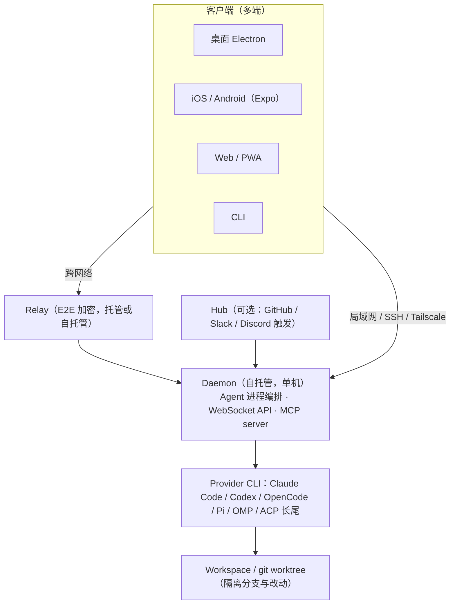

# Paseo 深度分析

## TL;DR

- Paseo 不是新的 Agent，而是 coding agent 的「control plane」：自托管 daemon 统一运行、监控既有 CLI Agent。
- 差异化在「克制」：官方明确保留 native CLI、订阅、skills、config 与 MCP servers，不修改 Provider 行为。
- 多端客户端：iOS / Android / 桌面 / Web / CLI 五类官方形态，移动端定位是监控与介入，不是写代码。
- 许可证：2026-08-27 起 AGPL-3.0-or-later 改为 Apache-2.0；付费点仅 Hosted Hub（€15/seat/月）。
- 主要风险：0.x 迭代期的稳定性、对上游 CLI 协议变动的适配依赖、插件供应链与 relay 网络细节。

## 1. 产品概览

- **公司 / 团队**：独立开源项目。创始人 Mo Boudra（GitHub @boudra；App Store 开发者为 Mohamed Boudra Ziani）[11][12][14]。第三方资料显示其同时为写作工具 Blank Page 联合创始人、前 Gitcoin Staff Engineer，待核实。
- **上线时间与重要节点**：
  - 最早可核实的公开发布：2026-03-16 Show HN 帖（作者 boudra）[12]；作者在 2026-03-26 的第二篇 Show HN 自述「2025 年 9 月开始做 Paseo，最初是 Claude Code 的 push-to-talk 语音界面」[13]。仓库 / 应用商店的确切首发日期仍待核实；App Store 最早用户评论可追溯到 2026-04-12 [14]。
  - 2026-08-25 v0.6.0；2026-08-27 v0.7.0-beta.1 起许可证由 AGPL-3.0-or-later 改为 Apache-2.0（重许可议题 #2982 于 2026-08-07 提出、2026-08-21 为贡献者同意截止，经 #3944 合入；v0.7.0 stable 2026-08-31 发布）[4][10][11]；版本演进：2026-09-02 v0.7.2（上一 stable）→ 2026-09-08 v0.8.0-beta.1（插件平台大幅扩展）→ 2026-09-10 v0.8.0（截至 2026-09-13 的当前 stable；官方升级注意：桌面端需 macOS 13+，0.7 插件须按迁移指南改造后才能加载）[10][17]。
  - 社区规模（2026-09-13 多次抓取）：GitHub 仓库页显示 15.5k stars / 1.7k forks；官网动态徽章在不同时点显示 16.9k 与 17.1k——动态徽章 / 页面缓存造成的口径差异待核实；2026-08-06 第三方报道约 12k [1][11][15]。
- **一句话定位**：「The control plane for coding agents」——自托管、多 Provider、开源的 coding agent 编排平台 [1]。
- **目标用户与核心场景**：已在并行使用多个 coding agent CLI 的开发者；离开电脑时需要远程监控与介入的人；偏好代码与凭据不出本机的自托管用户；想从 GitHub / Slack / Discord 触发 Agent 的小团队（Hub）[1][3][15]。

### 分类判断

本报告将其归入 `multi-agent`（多智能体编排）：Paseo 的核心正是多 Agent 的并行运行、worktree 隔离、跨 Provider 委托（如 Claude 派 Codex 子 Agent）与任务编排（Schedules、loop、handoff / committee Skills）[1][7][9][15]。需要说明：它不是 CrewAI 那类「角色分工」协作框架，而是对「已存在的 coding agent 进程」做编排与管控；同时它带有明显的 `agent-infra` 属性（daemon、relay、SDK、MCP 支撑层）。若后续 taxonomy 拆出「agent control plane / agent workspace」类目，Paseo 应优先迁移。

## 2. 核心能力

| 能力 | 说明 | 截至日期 | 来源 |
|---|---|---|---|
| 多 Provider 管理 | 官方 /agents 页：「Paseo runs the native CLI for 39 coding agents — your skills, your config, your MCP servers, all intact」；/docs/supported-providers 列 native 4 家（Claude Code、Codex、OpenCode、Pi）+ ACP catalog 36 项（本报告清点，页面未给总数，与 39 的总口径差 1）；首页 FAQ 又称 5 家 custom implementations（含 OMP/Oh My Pi）——官方页面间对 native / custom / ACP 的口径不完全一致，本报告保留差异 | 2026-09-13 | [1][2][5] |
| Worktree 隔离 | workspace 是产品概念（local / worktree 两种隔离模式），worktree 是其一；每个任务独立目录与分支，最后一个 workspace 归档后 worktree 自动移除；非 git 目录也可用 | 2026-09-13 | [1][6] |
| 多端客户端 | 桌面（Windows / Linux；0.8.0 stable 起升级要求 macOS 13+）、iOS、Android、Web / PWA、CLI；官方称移动端与桌面 full parity | 2026-09-13 | [1][10][17] |
| 远程访问 | E2E 加密 relay（默认关闭，配对时询问开启；托管或自托管）；v0.7.0 起 SSH 直连；亦可走 Tailscale 等自有隧道 | 2026-09-13 | [1][8][10] |
| 语音控制 | 默认本地语音（设备端转写 / TTS，含 Parakeet v3、sherpa TTS、Silero VAD）；可选 OpenAI 兼容云端语音 | 2026-09-13 | [1][4] |
| 调度与循环 | Schedules（cron 式定时 Agent，含时区对齐）；heartbeat（周期性 prompt 同一 Agent 续任务）；loop 循环执行直到满足验收条件 | 2026-09-13 | [4][7] |
| 跨 Provider 委托 | Agent 可用任意已配置 Provider / model 启动其他 Agent、按 ID 互发消息、跨机调度；Paseo tools 经 MCP 注入，默认关闭，需在 Settings → host → Agents 开启 | 2026-09-13 | [4][7][9] |
| 编排 Skills | `/paseo-handoff`（交接）、`/paseo-loop`（循环+verifier）、`/paseo-advisor`（顾问）、`/paseo-committee`（双 Agent 委员会）；`npx skills add getpaseo/paseo` | 2026-09-13 | [9] |
| 自动化接口 | CLI（run / ls / attach / send / schedule / loop 等）；TypeScript SDK `@getpaseo/client`；daemon 内置 MCP server（其他 Agent 可驱动 Paseo） | 2026-09-13 | [1][9] |
| Hub 触发 | 在 GitHub / Slack / Discord @bot 即可在自有 daemon 上启动 Agent；self-host 或托管 | 2026-09-13 | [3] |
| 插件系统 | TypeScript 插件（0.8 起）：主题、工作区面板、slash 命令、设置页、完整 Provider、生命周期钩子；`paseo plugin add <source>` | 2026-09-13 | [9][10][17] |
| 会话导入与回溯 | 导入终端中已开始的 Claude / Codex / OpenCode / Pi 会话；rewind 聊天与文件；上下文窗口计量与单会话成本累计 | 2026-09-13 | [4][10] |
| 权限管理 | Auto Review 模式（每轮后暂停）、per-provider 工具策略、fork PR setup 显式审批、会话级批准 | 2026-09-13 | [4][10] |
| 工作区内浏览器 / 终端 | Agent 可操作 in-app browser（页面快照、受信输入、tab 控制）；终端分屏与快照恢复 | 2026-09-13 | [4] |

## 3. 外部使用反馈与证据校验

> 本报告未做一手实测。主要外部证据：feisky.xyz 实测博客（2026-08-06 发布，作者 Pengfei Ni）[15]、App Store 用户评论与开发者回复 [14]、腾讯云开发者社区文章（原发 2026-05-01）[16]、创始人两篇 Show HN 帖（2026-03-16 / 03-26）[12][13]。

### 3.1 关键主张校验

| 主张 | 证据与校验 | 判断 |
|---|---|---|
| 「不重造 harness；CLAUDE.md、Skills、MCP、memory 全保留」 | 官方明确的是：运行 native CLI、保留 skills / config / MCP servers、不修改 Provider 行为、用你自己的订阅 [1][2][9]。CLAUDE.md 与 memory 属 Provider 原生机制，由「不修改行为」推断保留，官方未逐项承诺 | 官方承诺部分成立；延伸部分是合理推断 |
| 「子 Agent 可跨 Provider 调度：Claude→Codex、Codex→Grok」 | /docs/orchestration 确认 Agent 可用任意已配置 Provider 启动子 Agent；Paseo tools 默认不注入、需显式开启 [7][9] | 能力存在；委托质量待实测 |
| 「heartbeat：Agent 定时查 CI，失败自动修、通过自动停」 | /docs/orchestration：「Create heartbeats: prompt the same agent periodically to continue its task」[7]；feisky 描述的 CI 场景属具体用法 | 能力存在；效果待实测 |
| 「WebSocket 在 Cloudflare relay 上约 100 秒不活跃断开」 | 第三方单一样本，官方文档未提及 [15] | 待实测；长挂机场景需注意 |
| 「一个人从头写到尾，12k stars 全由独立开发者撑起」 | changelog / releases 有大量外部贡献者署名 [4][10]；重许可议题 #2982 列出约 50 名外部贡献者征求同意 [11] | 表述过强；准确说法是「独立发起 + 规模可见的社区贡献，核心维护集中度待 contributor 数据核实」 |

### 3.2 商店口碑与早期第三方视角

- App Store 评分 4.8 / 59（截至 2026-09-13）：好评集中在 clean、"just works"、远程指挥多 Agent；有用户请求 Codex 会话历史与 `/resume`，开发者回复 "it's coming!"（2026-05-03）[14]。后续版本已加入 Claude / Codex / OpenCode 会话导入与 Codex rewind 相关修复，与承诺方向一致 [4][10]。
- 腾讯云开发者社区文章（原发 2026-05-01）将其概括为「不替代现有 Agent，而是管理现有 Agent」，并强调 worktree 是并行可控的关键 [16]。与官方定位一致，可作为早期（0.2.x 时代）交叉参考。
- feisky 实测（2026-08-06）的结论：分层消息视图（只看消息 / 关键输出 / 工具调用）解决了 TUI 审查痛点，「用过之后就回不去了」；同时指出 beta 粗糙点（移动端手势、终端输入体验）与较高上手门槛 [15]。此为单作者体验，不能当作代表性结论。
- 创始人在 2026-03-16 Show HN 自述动机：遛弯时用手机 SSH 进 tmux 查看 Agent 状态体验糟糕，最初做的是纯语音 App，迭代数月后演化为现在的形态；当时自称 "free and open source (AGPL)"，与后续重许可议题互相印证 [11][12]。

## 4. 技术架构

### 4.1 分层

### 4.2 关键机制

- **底层模型**：Paseo 不带自有模型；Provider 即用户已安装的 CLI（凭据与订阅属于用户，Paseo 不存储、不传输 Provider API key）[1][8][9]。内部结构化生成（Agent 标题、分支名、commit message、PR 文案）复用已配置 Provider，按 Claude Haiku → Codex → OpenCode 瀑布降级 [4]。
- **工具与协议**：ACP（Agent Client Protocol）接入长尾 Agent；MCP 双向——daemon 内置 MCP server 让其他 Agent 驱动 Paseo，同时可向 Agent 注入 Paseo 编排工具（默认关闭）[4][7][9]；0.8 起插件 SDK 分离 client / server 入口并带版本门槛 [10]。
- **记忆与上下文**：不引入自有记忆系统，保留 Provider 原生机制（如 CLAUDE.md，由「不修改 Provider 行为」推断 [1][9]）；Paseo 自己提供的是上下文窗口计量（70% / 90% 阈值）、compaction 事件可见、rewind、会话导入 [4]。
- **部署形态**：自托管 daemon——桌面 App 内置、`npm install -g @getpaseo/cli`、Docker（`ghcr.io/getpaseo/paseo`，端口 6767，`PASEO_PASSWORD`）、Nix [1][9]；默认仅监听 `127.0.0.1:6767`，可选 Unix socket（完全隔离网络）、密码认证（bcrypt 存储、Bearer / WebSocket subprotocol）[8]；远程访问走 E2E 加密 relay（默认关闭，配对时询问）或 SSH / 自有隧道 [8][10]。

### 4.3 架构评价

1. **daemon / Hub 职责分离**：daemon 保持「单机一个精简可执行文件」，多租户、暴露互联网、团队协作全部上移到 Hub，且 Hub 复用与客户端相同的 RPC——官方明示「anyone can build their own hub on top of Paseo」[3]。
2. **合规姿态**：官方称不提取 token、不直接调用推理 API、走各 Provider 官方支持的集成方式 [1]。
3. **安全模型成文**：/docs/security 定义了威胁模型——relay 被设计为不可信（ECDH Curve25519 + NaCl box XSalsa20-Poly1305 端到端加密，relay 只能看到 IP / 时序 / 报文大小 / 会话 ID）、DNS rebinding 防护（Host 头 allowlist）、`0.0.0.0` 绑定警告、Docker 挂载收紧建议 [8]；changelog 另有持续加固记录（本地凭据权限 #825、shell 注入 / symlink 逃逸修复、relay 握手拒绝中途换钥、MCP 日志脱敏）[4]。
4. **对上游的适配层薄但关键**：上游 CLI 的协议变动曾多次直接破坏体验（OpenCode 1.14.42、Codex 0.151 分页线程等），Paseo 需持续跟进修复 [4]。

## 5. 定价与商业模式

| 方案 | 价格 | 包含内容 | 截至日期 |
|---|---|---|---|
| 客户端 + daemon + CLI + Skills | 免费开源（2026-08-27 起 Apache-2.0；此前 AGPL-3.0-or-later） | 全部个人功能 | 2026-09-13 |
| Agent 模型成本 | 用户自带 | 已有 CLI 订阅 / API key；Paseo 可在应用内查看部分 Provider 的 plan 用量 | 2026-09-13 |
| Hosted Hub | €15 / seat / 月（有免费试用；访问处于受控阶段） | GitHub / Slack / Discord 托管触发；seat = Hub 成员 + 待接受邀请，仅触发者不计 seat | 2026-09-13 |
| Self-hosted Hub | 免费 | `npx @getpaseo/hub` 自行运营，源码开放 | 2026-09-13 |
| 赞助 | 自愿 | GitHub Sponsors 等渠道 | 2026-09-13 |

来源：[1][3][4][9][10][11]。

**商业模式解读（本报告观点，非官方表述）**：核心完全开源免费、模型成本留在用户既有订阅，付费点只放在「托管团队触发服务」这一层；从 AGPL-3.0 改为 Apache-2.0（官方理由是「AGPL 的要求对期望的使用方式过于限制」[11]）也降低了企业自用与二次开发顾虑。对重度用户，真实成本仍在各 Agent 订阅与 API 额度——并行多 Agent 与 loop / heartbeat 会放大 token 消耗（推断，待实测）。

## 6. 生态与集成

- **Provider 目录**：官方口径「39 coding agents」[2]；/docs/supported-providers 列 native 4 家（Claude Code、Codex、OpenCode、Pi）+ ACP catalog 36 项（本报告清点，含 Cursor、Gemini CLI、GitHub Copilot、Grok、GLM Agent、Qwen Code、Kimi Code CLI、TRAE CLI、goose、Junie 等；4+36 与总数 39 差 1，系官方页面口径不一致）；首页 FAQ 称 5 家 custom implementations（含 OMP/Oh My Pi）——native / custom / ACP 的术语在官方页面间不完全一致，in-app catalog 为官方指定的 canonical 版本 [1][2][5]。
- **分发渠道**：App Store、Google Play、F-Droid（元数据）、桌面 DMG / deb / RPM / AppImage、Docker 镜像、Nix / NixOS、Web PWA [1][4][10]。
- **编辑器联动**：Open in editor 支持 VS Code、Cursor、Zed、WebStorm、Antigravity；另有 paseo-vscode 扩展（相关项目）[4][9]。
- **社区与本地化**：Discord、Reddit、GitHub；README 与界面多语言（EN / 中 / 日 / 韩，界面另有 ar / fr / ru / es / pt-BR）[1][4][9]。
- **官方自列替代品**：Conductor、Superset、OpenChamber、Happy Coder、Codex App、Claude Desktop、OpenCode Desktop [1]——该列表本身说明其自我定位在「多 Agent 编排 / 工作台」赛道。

## 7. 优势与局限

### 优势

1. **定位克制，切换成本低**：官方明确运行 native CLI、保留 skills / config / MCP servers、不修改 Provider 行为、使用既有订阅 [1][2][9]；由此推断 CLAUDE.md、memory 等 Provider 原生机制照常生效。不喜欢可随时切回原生 CLI。
2. **多端与远程体验**：iOS / Android / 桌面 / Web / CLI 五类官方客户端，移动端为「监控 + 介入」优化（推送、审批、语音），官方称移动端与桌面 full parity；远程链路 E2E 加密 [1][8][14][15]。
3. **并行工程化**：worktree 隔离、PR checks 展示 / 合并 / 自动归档、fork PR 显式 setup 审批 [1][4][6][10][16]。
4. **跨 Provider 编排是稀缺能力**：子 Agent 跨厂商委托 + handoff / loop / advisor / committee Skills，把「用多家 Agent 组队」产品化 [4][7][15]。
5. **自动化友好**：CLI / TypeScript SDK / MCP 三套接口，任何 Agent 或脚本都能驱动 Paseo [1][7][9]。

### 局限与风险

1. **0.x 迭代期**：版本线仍在 0.x、更新频繁（0.5→0.8 三个 minor 均在 2026-08~09 两个月内落地），桌面更新器、移动键盘、流式渲染等回归 bug 反复出现；插件 API 0.7→0.8 有 breaking change（0.7 插件须迁移后才能在 0.8 加载）[10][15][17]。
2. **上游依赖脆弱**：上游 CLI 协议变动（OpenCode 1.14.42、Codex 0.151 等）曾直接破坏体验，需等 Paseo 跟进适配 [4]。
3. **上手门槛**：必须先自行安装并配置好至少一个 Agent CLI；Paseo 不管理 Agent 环境 [9][15]。
4. **单机 daemon**：一台机器一个 daemon，多机需手动配置多 host；daemon 故障影响其上全部会话（有崩溃自动恢复，但不能根治）[4][9]。
5. **插件供应链**：插件运行在 daemon 机器上（可访问文件、终端、网络），安装即信任其代码；版本门槛与迁移机制 0.8 才建立 [9][10]。
6. **网络细节**：第三方报告 Cloudflare 反代下 WebSocket 约 100 秒空闲断连（单一来源，待实测）[15]。
7. **团队 / 企业功能早期**：Hub 的团队 provisioning、跨团队共享仍在路线图（官方明示 "Not built yet"）；治理、审计、SSO / 合规未见公开材料 [3]。
8. **维护主体**：项目由独立开发者发起并主导；社区贡献规模可见（#2982 列出约 50 名贡献者），但核心维护集中度待 contributor 数据核实 [11]。

## 8. 竞品速览

> 下表仅汇总已核实口径：Paseo 官方自列替代品 [1]、feisky 实测结论 [15]。Conductor / Superset / OpenChamber / Happy 等同类细节本轮未逐一核实，标注待核实。

| 维度 | Paseo | Claude Desktop / Codex App 等官方桌面 | Conductor / Superset / OpenChamber / Happy 等同类 |
|---|---|---|---|
| 产品形态 | 自托管 daemon + 多端客户端 | 厂商官方桌面 / 移动 App | Agent workspace / 编排器（细节待核实） |
| 多 Provider | 官方口径 39 家（native 4 + ACP 36，另有 FAQ 含 OMP 的口径差异） | 单一生态，对自家集成更深 | 待核实 |
| 远程与移动 | 原生 iOS / Android，官方称与桌面 full parity | 部分有移动端 | Happy 偏远程监控 / relay（第三方定位，待核实） |
| 开源许可 | Apache-2.0（2026-08-27 起） | 闭源 | 待核实 |
| 编排能力 | 跨 Provider 子 Agent + Skills + schedules + Hub 触发 | 厂商内多 Agent | 待核实 |

feisky 的比较结论可作参考：不需要远程访问与跨 Provider 编排、只想要更舒服的本地界面时，Claude Desktop 和 Codex App 开箱即用且对自家 Agent 集成更深；Paseo 的优势集中在「跨 Agent + 跨设备」两个场景 [15]。

## 9. 适用场景推荐

### 适合

- 同时订阅 / 使用 2 个以上 coding agent，想按任务选模型的开发者。
- 需要并行 fan-out（多 issue / 多 PR 同时开工）的仓库维护者。
- 经常离开电脑、要用手机盯进度、批权限、补指令的人。
- 强自托管 / 隐私偏好：代码与凭据不出本机，拒绝遥测与强制登录。
- 想从 Slack / GitHub / Discord 触发 Agent 的小团队（Hub）。
- 想基于 SDK / 插件 / MCP 构建自己的 Agent 工作台的开发者。

### 不适合 / 需谨慎

- 只用一个 Agent 且无远程需求：直接用原生桌面 App 更省事，集成更深 [15]。
- 不想维护 daemon / 服务器的用户（Docker / CLI 部署仍需基础运维）。
- 对稳定性极敏感的生产流水线：0.x 迭代期 + 上游适配风险需先试点。
- 期待成熟能力（团队共享、SSO / 审计、合规）的企业：Hub 路线图尚未落地 [3]。

## 10. 后续验证清单

1. 实测 worktree 并行与权限矩阵（Auto Review / Full Access / 会话级批准 / per-provider 工具策略）。
2. 移动端长任务监控与审批流实测（含推送时延、后台重连）。
3. Cloudflare 反代与自托管 relay 的 WebSocket 空闲断连行为。
4. 0.8 插件能力面审计：插件可触达的文件 / 终端 / 网络范围与版本门槛 enforcement。
5. Hosted Hub seat 计费边界与 GitHub / Slack / Discord 触发的权限模型。
6. 待核实事实项：仓库 / 应用商店的确切首发日期（早于 2026-03-16 Show HN？）、GitHub stars 口径差异（仓库页 15.5k vs 官网动态徽章 16.9k / 17.1k）、创始人背景（Blank Page / Gitcoin）、核心维护集中度（contributor 数据）。
7. 与 Conductor / Superset / OpenChamber / Happy 的功能与定位对比实测。

## 信息来源

| # | 来源 URL | 类型 | 访问日期 |
|---|---|---|---|
| 1 | https://paseo.sh/ | 官方 | 2026-09-13 |
| 2 | https://paseo.sh/agents | 官方 | 2026-09-13 |
| 3 | https://paseo.sh/hub | 官方 | 2026-09-13 |
| 4 | https://paseo.sh/changelog | 官方 | 2026-09-13 |
| 5 | https://paseo.sh/docs/supported-providers | 官方文档 | 2026-09-13 |
| 6 | https://paseo.sh/docs/workspaces | 官方文档 | 2026-09-13 |
| 7 | https://paseo.sh/docs/orchestration | 官方文档 | 2026-09-13 |
| 8 | https://paseo.sh/docs/security | 官方文档 | 2026-09-13 |
| 9 | https://github.com/getpaseo/paseo | 官方 GitHub | 2026-09-13 |
| 10 | https://github.com/getpaseo/paseo/releases | 官方 GitHub | 2026-09-13 |
| 11 | https://github.com/getpaseo/paseo/issues/2982 | 官方 GitHub（重许可议题） | 2026-09-13 |
| 12 | https://news.ycombinator.com/item?id=47397226 | 第三方（创始人 Show HN，2026-03-16，日期经 Algolia API 核实） | 2026-09-13 |
| 13 | https://news.ycombinator.com/item?id=47529963 | 第三方（创始人 Show HN，2026-03-26，日期经 Algolia API 核实） | 2026-09-13 |
| 14 | https://apps.apple.com/us/app/paseo-remote-coding-agents/id6758887924 | 第三方（商店页 + 用户评论） | 2026-09-13 |
| 15 | https://feisky.xyz/posts/2026-08-06-paseo-multi-agent-console/ | 第三方实测（发布于 2026-08-06） | 2026-09-13 |
| 16 | https://developer.cloud.tencent.com/article/2698548 | 第三方（原发 2026-05-01） | 2026-09-13 |
| 17 | https://github.com/getpaseo/paseo/releases/tag/v0.8.0 | 官方 GitHub（v0.8.0 release） | 2026-09-13 |

## 更新记录

| 日期 | 变更 |
|---|---|
| 2026-09-13 | 初版：基于官方站点 / Hub / Changelog / GitHub 与三处第三方来源整理；未包含一手实测。 |
| 2026-09-13 | 补充 Provider 口径、AGPL-3.0-or-later 到 Apache-2.0 的许可证时间线、Show HN 发布证据、官方架构 / 安全文档与第三方体验证据；同步 v0.8.0 当前版本信息。 |
